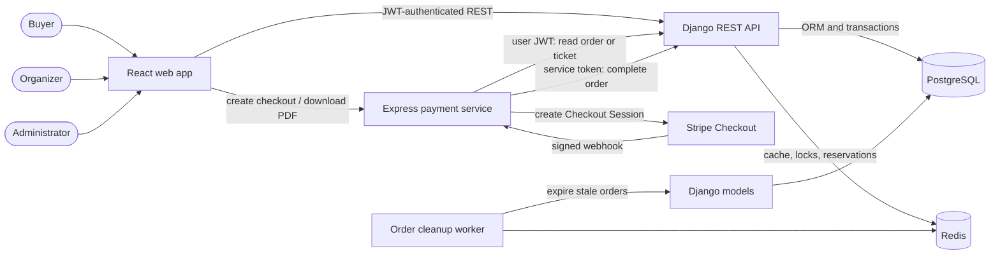
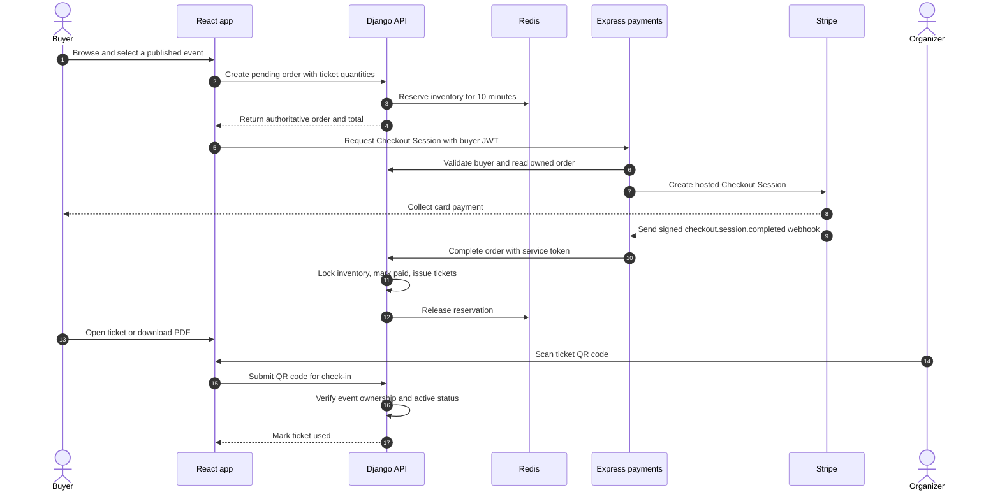

<div align="center">
  

# TicketFlow

**A full-stack event discovery, ticket sales, payment, and venue check-in platform.**

[](https://react.dev/)
[](https://www.typescriptlang.org/)
[](https://www.djangoproject.com/)
[](https://www.django-rest-framework.org/)
[](https://expressjs.com/)
[](https://www.postgresql.org/)
[](https://redis.io/)
[](https://stripe.com/)
[](https://www.docker.com/)

</div>

TicketFlow is a production-style portfolio project that connects a responsive React application, a Django REST domain API, and a focused Express payment service. Buyers can discover events and purchase tickets, approved organizers can publish events and scan admissions, and administrators can review organizer accounts—all backed by durable relational data, short-lived Redis reservations, Stripe Checkout, and QR-based tickets.

## Contents

- [Project overview](#project-overview)
- [Architecture](#architecture)
- [Repository structure](#repository-structure)
- [Technology stack](#technology-stack)
- [Implemented capabilities](#implemented-capabilities)
- [Documentation](#documentation)
- [Quick start](#quick-start)
- [Local development](#local-development)
- [Docker architecture](#docker-architecture)
- [Purchase and check-in workflow](#purchase-and-check-in-workflow)
- [Why this architecture](#why-this-architecture)
- [Portfolio highlights](#portfolio-highlights)
- [Future development](#future-development)

## Project overview

TicketFlow models the principal workflows of an event ticketing business:

- Buyers browse published events, search and filter the catalog, create orders, complete hosted Stripe Checkout, and access their tickets.
- Organizers apply for approval, create and edit events with ticket inventory, manage their event portfolio, and validate attendees by scanning ticket QR codes.
- Administrators review organizer applications and access platform-level user and operational views.

React owns the browser experience. Django owns the platform domain and durable business state. Express owns the Stripe and ticket-document integration boundary.

## Architecture

TicketFlow separates presentation, domain logic, and payment-provider integration while keeping ownership clear between services.

*System context and service boundaries*



### Service responsibilities

| Boundary | Ownership |
|---|---|
| React web application | Public discovery and role-aware buyer, organizer, and administrator experiences. |
| Django REST API | Identity, authorization, events, pricing, inventory, orders, tickets, and admission state. |
| Express payment service | Stripe Checkout, signed webhooks, payment synchronization, and ticket PDF generation. |
| PostgreSQL | Durable relational business data. |
| Redis | Expiring cache entries, checkout reservations, and coordination locks. |
| Stripe | Hosted card checkout and payment event delivery. |
| Order cleanup worker | Expiry of stale pending orders and their reservations. |

## Repository structure

| Path | Contents |
|---|---|
| [`web/`](./web/) | React and TypeScript single-page application, UI system, browser API clients, screenshots, and frontend Docker image. |
| [`api/`](./api/) | Django REST API, domain applications, migrations, seed data, management commands, and API Docker image. |
| [`payments/`](./payments/) | Express and TypeScript integration service for Stripe Checkout, webhooks, and ticket PDFs. |
| [`docker-compose.yml`](./docker-compose.yml) | Local six-service application and infrastructure topology. |
| [`.env.example`](./.env.example) | Root configuration template used by Docker Compose. |

## Technology stack

The platform uses a typed React frontend, a domain-focused Django API, and a dedicated TypeScript payment service.

| Layer | Core technologies | Role |
|---|---|---|
| Frontend | React 19, TypeScript 6, Vite 8, React Router 7, Tailwind CSS 4 | Responsive UI, role-aware routing, REST integration, and QR experiences. |
| Backend API | Python 3.14, Django 6, Django REST Framework 3.17, Simple JWT | Domain modeling, REST APIs, authentication, authorization, and transactions. |
| Payments | Node.js 22, Express 5, TypeScript, Stripe SDK | Checkout orchestration, signed webhooks, Django synchronization, and ticket PDFs. |
| Data | PostgreSQL 16, Redis 7 | Durable business state, caching, reservations, and coordination. |
| Tooling | Docker Compose, ESLint, Ruff, pytest, OpenAPI | Local orchestration, code quality, API validation, and interactive documentation. |

Package-level details and commands are documented in the [frontend](./web/README-WEB.md), [API](./api/README-API.md), and [payment](./payments/README-PAYMENTS.md) guides.

## Implemented capabilities

| Area | Capability |
|---|---|
| Identity | Email login, JWT access and refresh lifecycle, logout blacklisting, and buyer, organizer, and administrator roles. |
| Organizer governance | Organizer applications, approval or rejection, company profiles, and approval-gated event operations. |
| Event discovery | Published-event catalog, details by slug, category and location filters, search, ordering, and pagination. |
| Event management | Organizer-owned event creation, editing, status transitions, cover images, and nested ticket types. |
| Inventory | Server-calculated pricing, remaining quantities, Redis-backed reservations, expiry, and database locking during fulfillment. |
| Checkout | Pending order creation and card payment through Stripe-hosted Checkout. |
| Payment synchronization | Raw-body webhook signature verification and service-authenticated completion in Django. |
| Ticket fulfillment | One UUID-backed ticket per purchased unit after successful payment. |
| Ticket access | Buyer ticket views, QR display, and downloadable PDF generation. |
| Venue admission | Camera-based QR scanning, organizer ownership checks, and duplicate check-in prevention. |
| Administration | User views and organizer application review with status filters and rejection reasons. |
| User experience | Responsive layouts, route-level lazy loading, light/dark themes, loading states, and API error feedback. |
| API operations | Health endpoints, seed data, OpenAPI schema, Swagger UI, ReDoc, filtering, throttling, and pagination. |
| Local infrastructure | One-command startup for the full stack, persistent PostgreSQL and Redis volumes, and health-gated dependencies. |

## Documentation

The component guides contain endpoint contracts, internal structure, and service-specific development instructions.

| Component | Documentation | Covers |
|---|---|---|
| React frontend | [README-WEB.md](./web/README-WEB.md) | Routes, UI architecture, state and authentication, API clients, responsive design, and frontend setup. |
| Django REST API | [README-API.md](./api/README-API.md) | Domain model, endpoints, permissions, inventory safety, API setup, and operational commands. |
| Express Stripe service | [README-PAYMENTS.md](./payments/README-PAYMENTS.md) | Checkout, webhook trust boundaries, Django integration, PDF generation, and payment-service setup. |

## Quick start

Run the complete platform with Docker Compose. Stripe test credentials are required for checkout; the Stripe CLI supports local webhook forwarding.

```bash
git clone https://github.com/AhmedOzdogan/ticketflow.git
cd ticketflow
cp .env.example .env
```

Add a Django secret, matching service tokens, the PostgreSQL URL, and Stripe test keys to `.env`, then start the platform:

```bash
docker compose up --build
```

### Local services

| URL | Service |
|---|---|
| <http://localhost:5173> | TicketFlow web application |
| <http://localhost:8000/api/schema/swagger/> | Interactive API documentation |
| <http://localhost:8000/admin/> | Django administration |
| <http://localhost:5001/> | Payment service health response |

The Docker development environment applies migrations and prepares a clean sample dataset whenever the API starts. This provides a repeatable local experience; production deployments would retain application data without reseeding.

### Local Stripe webhooks

In another terminal, forward Stripe events to the Express webhook route:

```bash
stripe listen --forward-to localhost:5001/webhook
```

Use the webhook signing secret printed by the Stripe CLI as `STRIPE_WEBHOOK_SECRET`.

## Local development

### Docker workflow

```bash
# Start or rebuild all services
docker compose up --build

# Follow service logs
docker compose logs -f api payment web order-cleanup

# Stop containers while retaining named data volumes
docker compose down
```

Source directories are bind-mounted into their containers. Vite, Django's development server, and the payment service's `tsx watch` process support an edit-and-refresh development loop.

### Running services individually

Each application can also run independently:

1. Start PostgreSQL and Redis, or point the API at existing instances.
2. Configure the API using [`api/.env.example`](./api/.env.example), install `api/requirements.txt`, migrate, and run Django on port `8000`.
3. Configure and start the payment service on port `5001` with `npm run dev` from `payments/`.
4. Configure and start the browser application on port `5173` with `npm run dev` from `web/`.

Detailed commands are maintained in the [frontend](./web/README-WEB.md), [API](./api/README-API.md), and [payment](./payments/README-PAYMENTS.md) guides.

### Environment boundaries

| Variable group | Used by | Notes |
|---|---|---|
| `DJANGO_*`, `DATABASE_URL`, `REDIS_URL` | Django API and cleanup worker | Django runtime, PostgreSQL, and Redis configuration. |
| `PAYMENT_SERVICE_TOKEN` | Django API | Authorizes the internal payment-completion endpoint. |
| `DJANGO_API`, `DJANGO_API_TOKEN` | Express service | API location and matching service credential. |
| `STRIPE_SECRET_KEY`, `STRIPE_PUBLISHABLE_KEY`, `STRIPE_WEBHOOK_SECRET` | Payment workflow | Stripe test credentials and webhook verification. |
| `VITE_API_BASE_URL` | React application | Browser-visible Django base URL. Compose supplies `http://127.0.0.1:8000/api`. |
| `PORT` | Express service | Defaults to the Compose-exposed payment port, `5001`. |

Keep `.env` and real credentials outside version control. The checked-in example provides sample configuration.

## Docker architecture

`docker compose up` creates the following runtime graph:

| Container | Port | Starts after | Responsibility |
|---|---:|---|---|
| `ticketflow-postgres` | 5432 | — | PostgreSQL 16 database with a named persistent volume. |
| `ticketflow-redis` | 6379 | — | Redis 7 with append-only persistence and a named volume. |
| `ticketflow-api` | 8000 | Healthy PostgreSQL and Redis | Applies migrations, prepares sample data, and serves the Django API. |
| `ticketflow-payments` | 5001 | Healthy API | Runs Express in TypeScript watch mode. |
| `ticketflow-web` | 5173 | Healthy API | Runs the Vite development server. |
| `ticketflow-order-cleanup` | — | Healthy PostgreSQL and Redis | Executes expired-order cleanup once per minute. |

Health checks prevent dependent application containers from starting before PostgreSQL, Redis, and Django are ready. The application containers use bind mounts for development; PostgreSQL and Redis use named volumes.

## Purchase and check-in workflow

The complete buyer journey crosses the service boundary only where payment processing requires it.

*Checkout, fulfillment, and venue admission sequence*



The payment service never decides ticket ownership, price, inventory, or admission. It obtains those facts from Django and reports verified Stripe identifiers back through a separate service-authenticated path.

## Why this architecture?

### Django remains the source of truth

Identity, event ownership, prices, orders, inventory, issued tickets, and check-in state share transactional rules. Keeping them in Django and PostgreSQL allows permissions and database transactions to protect the complete domain workflow.

### Payments have a narrow integration boundary

The Express service contains Stripe secrets, raw webhook parsing, provider-specific Checkout logic, remote artwork handling, QR generation, and PDF composition. This keeps external payment and document concerns out of the core API while preserving Django's authority.

### Browser and server contracts stay explicit

React consumes versioned REST endpoints and keeps presentation concerns in the frontend. User JWTs protect browser-driven reads and writes; a separate shared token protects webhook-driven service callbacks.

### Redis stores disposable coordination state

Checkout holds and public-event cache entries are temporary by nature. Redis supports expiring reservations and locks without turning transient coordination into durable relational records.

### PostgreSQL stores durable business state

Users, events, inventory totals, orders, payment identifiers, tickets, and admissions require constraints, relations, and transaction support. PostgreSQL is the canonical store for those records.

### UUIDs and slugs serve different audiences

Domain records use non-sequential UUID primary keys. Public event pages use readable, generated slugs, keeping browser URLs descriptive while internal relationships retain stable identifiers.

## Portfolio highlights

TicketFlow demonstrates engineering across application, data, integration, and operational boundaries.

| Competency | Evidence in the repository |
|---|---|
| Distributed architecture | Three application services with explicit ownership and user-to-service trust paths. |
| Full-stack development | Cohesive buyer, organizer, and administrator workflows from React through Django and PostgreSQL. |
| API and domain design | Versioned REST resources, relational models, permissions, filtering, pagination, and transactional fulfillment. |
| Secure authentication | Rotating JWTs, refresh-token blacklisting, role authorization, ownership checks, and a dedicated service credential. |
| Payment integration | Stripe-hosted Checkout, raw-body signature verification, webhook synchronization, and provider identifiers. |
| Concurrency and inventory | Redis reservations and locks combined with PostgreSQL transactions and row locking. |
| Modern frontend engineering | Typed API modules, reusable React components, protected routes, responsive layouts, and QR scanning. |
| Container orchestration | Health-gated Docker Compose services, development bind mounts, persistence, and background cleanup. |

For a deeper engineering review, start with the [API architecture](./api/README-API.md#architecture), [frontend system context](./web/README-WEB.md#system-context), or [payment trust boundaries](./payments/README-PAYMENTS.md#architecture).

## Future development

TicketFlow's next evolution can expand its operational depth while preserving the existing service boundaries.

| Area | Direction |
|---|---|
| Infrastructure | Environment-specific runtime profiles, hardened production containers, and managed secret configuration. |
| Developer experience | Startup-time environment validation and configurable browser, API, and Stripe redirect origins. |
| Testing | Automated API, frontend, payment-service, and end-to-end coverage. |
| Automation | Repository workflows for linting, builds, tests, migrations, and container images. |
| Observability | Structured logging, service metrics, tracing, health reporting, and operational guidance. |
| Payments | Broader lifecycle handling for payment failures, cancellations, and refunds. |
| Deployment | Kubernetes manifests, release configuration, and production deployment documentation. |
| Documentation | Shared technical references for cross-service operations and architectural decisions. |

---

Explore the platform by running the [Quick start](#quick-start), then use the [component documentation](#documentation) to follow the part of the system most relevant to you.

