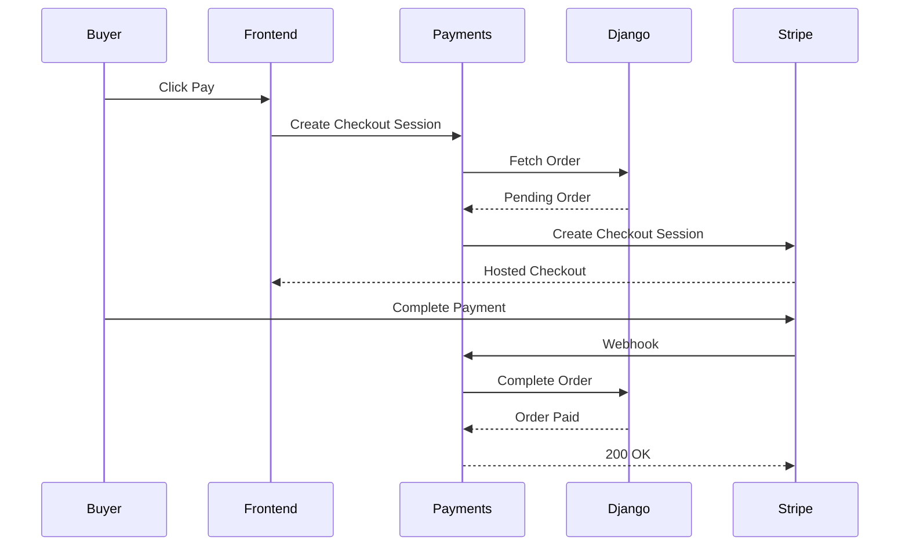
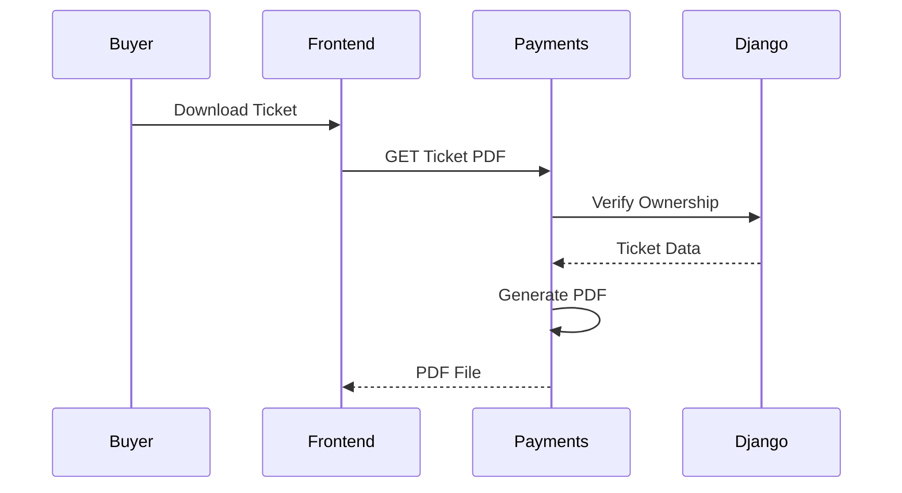

# 💳 TicketFlow Payments Service

<p align="center">
  
  
  
  
  
  
</p>

---

# 📖 Overview

The **TicketFlow Payments Service** is a standalone Express.js microservice responsible for handling all payment-related functionality within the TicketFlow platform.

Rather than embedding Stripe logic directly inside the Django backend, payments are isolated into a dedicated service responsible for:

- 💳 Creating Stripe Checkout Sessions
- 🎟️ Generating downloadable PDF tickets
- 🔐 Authenticating and authorizing payment requests
- 🔄 Processing Stripe Webhooks
- 🤝 Communicating securely with the Django API

This architecture keeps business logic inside Django while allowing the payment service to focus exclusively on Stripe integration and document generation.

---

# ✨ Features

## 💳 Payments

- Stripe Checkout integration
- Card payments
- Pending order validation
- Secure payment session creation
- Payment completion through Stripe Webhooks

---

## 🎟 Ticket Management

- Download printable PDF tickets
- QR Code generation
- Event cover image embedding
- Automatic PDF generation
- Owner verification before download

---

## 🔐 Authentication

Protected endpoints use JWT authentication through the Django backend.

Features include:

- Buyer authentication
- Role-based authorization
- Verified email requirement
- Ownership validation
- Internal service authentication

---

## 🔄 Service Communication

The payment service communicates with Django using two different authentication mechanisms.

### User Authentication

Used whenever a logged-in user performs an action.

```
Frontend
      │
JWT
      ▼
Payments API
      │
Bearer Token
      ▼
Django API
```

---

### Internal Service Authentication

Used for trusted server-to-server operations.

```
Stripe
     │
Webhook
     ▼
Payments API
     │
Service Token
     ▼
Django API
```

This separation prevents exposing privileged service credentials while still allowing authenticated users to access their own resources.

---

# 🏗 Architecture

```text
                    +-------------------+
                    |   React Frontend  |
                    +---------+---------+
                              |
                         JWT Authentication
                              |
                              ▼
                    +-------------------+
                    | Payments Service  |
                    | Express + Stripe  |
                    +----+---------+----+
                         |         |
                         |         |
               Stripe API|         |Django API
                         |         |
                         ▼         ▼
            +-----------------+  +----------------+
            |     Stripe      |  | Django Backend |
            +-----------------+  +----------------+
```

---

# 🛠 Tech Stack

| Technology | Purpose |
|------------|---------|
| TypeScript | Type Safety |
| Express.js | REST API |
| Stripe SDK | Payment Processing |
| Axios | Django Communication |
| PDF-Lib | PDF Generation |
| QRCode | QR Code Creation |
| Sharp | Image Processing |
| Docker | Containerization |

---

# 📁 Project Structure

```
payments/
│
├── src/
│   ├── config/
│   │      stripe.ts
│   │      env.ts
│   │
│   ├── controllers/
│   │      payment.controller.ts
│   │      ticket.controller.ts
│   │      webhook.controller.ts
│   │
│   ├── middlewares/
│   │      requireAuth.ts
│   │
│   ├── routes/
│   │      payment.routes.ts
│   │      ticket.routes.ts
│   │      webhook.routes.ts
│   │
│   ├── services/
│   │      django.service.ts
│   │      stripe.service.ts
│   │      pdf.service.ts
│   │
│   ├── types/
│   │
│   ├── app.ts
│   └── server.ts
│
├── Dockerfile
├── package.json
└── README.md
```

---

# 🚀 Getting Started

## Clone the repository

```bash
git clone https://github.com/yourusername/ticketflow.git
```

---

## Navigate to the payments service

```bash
cd ticketflow/payments
```

---

## Install dependencies

```bash
npm install
```

---

## Run locally

```bash
npm run dev
```

The server starts on

```
http://localhost:5001
```

---

# 🐳 Docker

The payment service is designed to run alongside the Django backend and PostgreSQL using Docker Compose.

Start the entire application:

```bash
docker compose up --build
```

The Payments API will be available at

```
http://localhost:5001
```

---

# ⚙ Environment Variables

| Variable | Description |
|-----------|-------------|
| PORT | Express server port |
| STRIPE_SECRET_KEY | Stripe Secret Key |
| STRIPE_WEBHOOK_SECRET | Stripe Webhook Secret |
| DJANGO_API | Django API Base URL |
| DJANGO_API_TOKEN | Internal Service Token |

Example:

```env
PORT=5001

DJANGO_API=http://api:8000/api/v1
DJANGO_API_TOKEN=your-service-token

STRIPE_SECRET_KEY=sk_test_...

STRIPE_WEBHOOK_SECRET=whsec_...
```

---

# 🔒 Security

The payment service was designed following the principle of **least privilege**.

## User Requests

Authenticated users communicate with Django using their own JWT access token.

```
Authorization: Bearer <JWT>
```

Only the owner of an order or ticket can access those resources.

---

## Internal Requests

Webhook operations use a dedicated service token instead of a user JWT.

```
X-Service-Token
```

This allows Stripe webhooks to perform privileged operations without exposing user credentials.

---

# Design Goals

The payment service follows several architectural principles:

- Separation of concerns
- Thin controllers
- Service-oriented architecture
- Principle of least privilege
- Secure communication
- Stateless design
- Production-ready Docker support
- Clear responsibility boundaries

```
# 📡 API Reference

The Payments Service exposes four REST endpoints.

| Method | Endpoint | Authentication | Description |
|----------|-----------------------------|-----------------|-------------------------------|
| GET | `/` | ❌ | Health Check |
| POST | `/payment/create-checkout-session` | ✅ Buyer | Creates a Stripe Checkout Session |
| GET | `/api/tickets/:ticketId/pdf` | ✅ Buyer | Downloads a PDF Ticket |
| POST | `/webhook` | Stripe Signature | Processes Stripe Webhooks |

---

# Health Check

## GET /

Returns the service status.

### Request

No authentication required.

### Response

```json
{
    "service": "TicketFlow Payments API",
    "status": "running"
}
```

### Example

```bash
curl http://localhost:5001/
```

---

# 💳 Create Checkout Session

## POST /payment/create-checkout-session

Creates a Stripe Checkout Session for an existing **pending** order.

Only authenticated buyers are allowed to create checkout sessions.

---

## Authentication

```http
Authorization: Bearer <ACCESS_TOKEN>
```

---

## Request Body

```json
{
    "order_id": "5ef983d0-cd2e-4f7d-a60e-c48efca9e390"
}
```

---

## Success Response

Status

```text
200 OK
```

```json
{
    "checkout_url": "https://checkout.stripe.com/c/pay/cs_test_xxxxxxxxx",
    "session_id": "cs_test_xxxxxxxxx"
}
```

The frontend should redirect the user directly to

```text
checkout_url
```

---

## Possible Errors

### Missing order id

```text
400 Bad Request
```

```json
{
    "message": "order_id is required."
}
```

---

### Order already paid

```text
409 Conflict
```

```json
{
    "message": "Order is no longer pending."
}
```

---

### Invalid Token

```text
401 Unauthorized
```

```json
{
    "message": "Invalid or expired token."
}
```

---

### Order not found

```text
404 Not Found
```

```json
{
    "message": "Order not found."
}
```

---

### Forbidden

```text
403 Forbidden
```

Returned if the authenticated buyer attempts to access another buyer's order.

---

#  Download Ticket

## GET

```text
/api/tickets/:ticketId/pdf
```

Downloads a printable PDF version of the ticket.

---

## Authentication

```http
Authorization: Bearer <ACCESS_TOKEN>
```

---

## URL Parameters

| Parameter | Description |
|------------|-------------|
| ticketId | Ticket UUID |

Example

```text
/api/tickets/99ec6d62-5923-4f2f-b6d5-39bd87d53ea2/pdf
```

---

## Success Response

Status

```text
200 OK
```

Headers

```http
Content-Type: application/pdf
Content-Disposition: attachment;
```

Body

```
Binary PDF File
```

---

## Security

This endpoint performs ownership verification.

Only the owner of the ticket can download it.

Attempting to access another user's ticket returns

```text
403 Forbidden
```

---

## PDF Contents

Each ticket contains

- Event Cover Image
- Event Title
- Ticket Type
- Owner Name
- Purchase Date
- Ticket ID
- QR Code
- Ticket Status

---

## Possible Errors

### Invalid token

```text
401 Unauthorized
```

---

### Ticket not found

```text
404 Not Found
```

---

### Forbidden

```text
403 Forbidden
```

---

### Internal error

```text
503 Service Unavailable
```

---

# 🔄 Stripe Webhook

## POST

```text
/webhook
```

Receives payment events directly from Stripe.

This endpoint **must never** be called by frontend applications.

---

## Authentication

Unlike other endpoints, this route does **not** use JWT authentication.

Instead Stripe authenticates itself using the webhook signature.

```
Stripe
      │
stripe-signature
      │
      ▼
Payments Service
```

---

## Required Header

```http
Stripe-Signature
```

---

## Supported Events

Currently supported

```
checkout.session.completed
```

---

## Processing Flow

When Stripe confirms a successful payment

1. Verify webhook signature
2. Read Checkout Session
3. Extract Order ID
4. Call Django
5. Complete Order
6. Generate Tickets
7. Return success

---

## Success Response

```json
{
    "received": true
}
```

---

## Possible Errors

### Missing signature

```text
400 Bad Request
```

```
Missing Stripe signature.
```

---

### Invalid signature

```text
400 Bad Request
```

```
Invalid webhook signature.
```

---

### Missing order id

```text
400 Bad Request
```

```
Missing order ID.
```

---

# 🔄 Complete Payment Flow



---

# 🎫 Ticket Download Flow



---

# 🔐 Authentication Flow

Protected endpoints use the authenticated user's JWT.

```text
React
     │
Bearer Token
     ▼
Payments API
     │
Bearer Token
     ▼
Django API
```

Django validates

- Authentication
- User Role
- Email Verification
- Resource Ownership

No authorization decisions are made inside Express.

Business rules always remain inside Django.

---

# 🛡 Authorization Matrix

| Endpoint | Buyer | Organizer | Admin | Anonymous |
|------------|--------|------------|--------|------------|
| Health | ✅ | ✅ | ✅ | ✅ |
| Checkout Session | ✅ | ❌ | ❌ | ❌ |
| Download Ticket | ✅ Owner Only | ❌ | ❌ | ❌ |
| Webhook | Stripe Only | Stripe Only | Stripe Only | ❌ |

---

# ⚠ Error Handling

| Status | Meaning |
|----------|--------------------------|
| 200 | Success |
| 400 | Invalid request |
| 401 | Authentication failed |
| 403 | Permission denied |
| 404 | Resource not found |
| 409 | Order already processed |
| 500 | Internal server error |
| 503 | External service unavailable |
# 🔒 Security

Security was one of the primary design goals of the TicketFlow Payments Service.

Rather than relying solely on the payment service for authorization, all business-critical authorization decisions remain inside the Django backend.

---

## JWT Authentication

Protected routes require a valid JWT access token.

```
Authorization: Bearer <ACCESS_TOKEN>
```

The payment service forwards the token to Django, which verifies:

- User identity
- Token validity
- Email verification
- User role
- Resource ownership

This ensures authorization logic exists in a single place.

---

## Role-Based Authorization

Only authenticated buyers can perform payment operations.

| Role | Checkout | Download Ticket |
|------|----------|-----------------|
| Buyer | ✅ | ✅ Own Tickets |
| Organizer | ❌ | ❌ |
| Admin | ❌ | ❌ |
| Anonymous | ❌ | ❌ |

---

## Ownership Validation

Even with a valid JWT, users cannot access resources that do not belong to them.

Examples:

- Buyers cannot pay another user's order.
- Buyers cannot download another user's ticket.

Ownership verification is always performed by Django.

---

## Service-to-Service Authentication

Webhook operations are not performed on behalf of a user.

Instead, the payment service authenticates itself using an internal service token.

```
Payments Service
        │
X-Service-Token
        ▼
Django API
```

This prevents exposing privileged operations through public endpoints.

---

## Stripe Webhook Verification

Incoming webhook requests are verified using the Stripe SDK.

```
Stripe
      │
Webhook Signature
      ▼
Payments Service
```

Invalid signatures are rejected before any business logic is executed.

---

# 🐳 Docker Deployment

The service is designed to run inside Docker alongside the Django backend.

Example architecture

```text
                    Docker Network

+-------------+      +-------------+      +--------------+
| React (Vite)| ---> |  Payments   | ---> |    Django    |
+-------------+      +-------------+      +--------------+
                             |
                             |
                             ▼
                       +-------------+
                       |   Stripe    |
                       +-------------+
```

The payment service communicates with Django using the Docker service hostname.

Example

```env
DJANGO_API=http://api:8000/api/v1
```

---

# ⚙ Configuration

Environment variables

| Variable | Required | Description |
|------------|----------|----------------------------|
| PORT | ✅ | Express server port |
| DJANGO_API | ✅ | Django API URL |
| DJANGO_API_TOKEN | ✅ | Internal service token |
| STRIPE_SECRET_KEY | ✅ | Stripe Secret Key |
| STRIPE_WEBHOOK_SECRET | ✅ | Stripe Webhook Secret |

---

# 🧪 Testing

The service can be tested using Postman or the Stripe CLI.

---

## Health Check

```bash
curl http://localhost:5001/
```

---

## Create Checkout Session

```bash
curl -X POST http://localhost:5001/payment/create-checkout-session \
-H "Authorization: Bearer ACCESS_TOKEN" \
-H "Content-Type: application/json" \
-d '{
  "order_id":"YOUR_ORDER_ID"
}'
```

---

## Download Ticket

```bash
curl -OJ \
-H "Authorization: Bearer ACCESS_TOKEN" \
http://localhost:5001/api/tickets/TICKET_ID/pdf
```

---

## Test Stripe Webhook

Install Stripe CLI

```bash
stripe login
```

Forward webhook events

```bash
stripe listen \
--forward-to localhost:5001/webhook
```

Trigger a payment event

```bash
stripe trigger checkout.session.completed
```

---

# 👨‍💻 Author

**Ahmed Özdoğan**

Full-Stack Developer

### Technologies

- TypeScript
- React
- React Native
- Django
- Express.js
- PostgreSQL
- Docker
- Stripe
- CI/CD


# 📄 License

This project is licensed under the MIT License.

---

#  Project Highlights

This project demonstrates experience with:

- Designing secure microservice architectures
- Stripe Checkout integration
- JWT authentication
- Role-based authorization
- Service-to-service authentication
- PDF generation
- QR code generation
- Docker networking
- Express.js
- TypeScript
- REST API design
- Secure webhook processing
- Production-ready backend architecture

---

<p align="center">

**Built with using TypeScript, Express, Stripe and Django**

 If you found this project interesting, consider giving it a star ⭐!

</p>