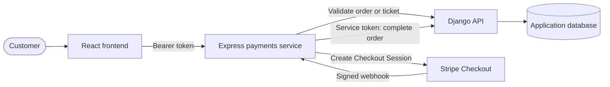
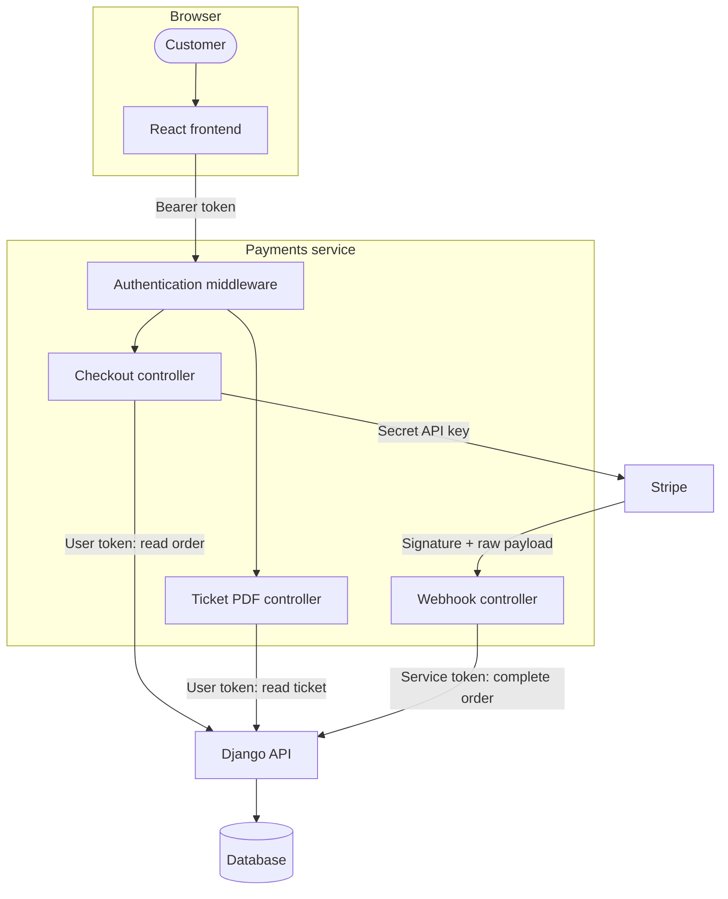
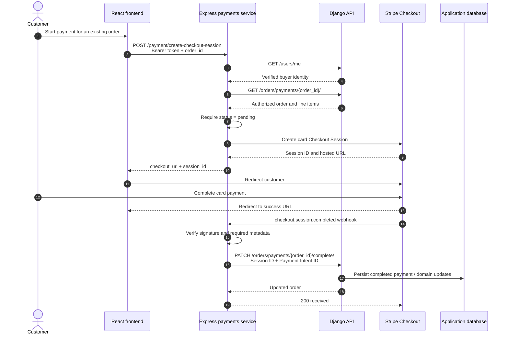

# TicketFlow Payments Service

<p align="center">
  <strong>Stripe Checkout, verified payment completion, and downloadable event tickets for the TicketFlow platform.</strong>
</p>

<p align="center">
  
  
  
  
  
</p>

TicketFlow Payments is a focused Express.js service at the boundary between the TicketFlow application, Stripe, and the Django domain API. It creates card-payment Checkout Sessions from server-validated orders, accepts signed Stripe events, records successful payments through a privileged backend channel, and produces personalized PDF tickets for authenticated buyers.

## Table of contents

- [Overview](#overview)
- [Project metrics](#project-metrics)
- [Responsibilities](#responsibilities)
- [Features](#features)
- [Tech stack](#tech-stack)
- [Architecture](#architecture)
- [Project structure](#project-structure)
- [Payment flow](#payment-flow)
- [Stripe integration](#stripe-integration)
- [Security model](#security-model)
- [API overview](#api-overview)
- [Environment variables](#environment-variables)
- [Local development](#local-development)
- [Docker](#docker)
- [Error handling](#error-handling)
- [Engineering decisions](#engineering-decisions)
- [Future improvements](#future-improvements)
- [Portfolio value](#portfolio-value)



## Overview

The Django API remains the source of truth for users, orders, ticket ownership, and payment state. This service owns the integration-heavy edge of the workflow: translating an approved order into Stripe line items, verifying Stripe's webhook signature against the untouched request body, and sending Stripe identifiers back to Django after Checkout completes.

Keeping these concerns in a dedicated process limits the reach of Stripe credentials, prevents payment-provider code from leaking into the core domain API, and gives webhook and document-generation workloads an independent deployment boundary. Communication with Django uses the customer's bearer token for user-scoped reads and a separate service token for the webhook-driven order completion call.

## Project metrics

These figures are calculated from the current `src/` tree and mounted Express routes.

| Surface | Count | What it represents |
|---|---:|---|
| API endpoints | 4 | Health, Checkout creation, Stripe webhook, ticket PDF download |
| Route modules | 3 | Payment, webhook, and ticket routing |
| Controllers | 3 | One HTTP controller per route module |
| Service modules | 3 | Stripe orchestration, Django communication, PDF rendering |
| Middleware modules | 1 | Django-backed authentication and authorization |
| External API integrations | 2 | Stripe and the TicketFlow Django API |
| Container definitions | 1 | Node.js 22 Alpine `Dockerfile` |

## Responsibilities

- Authenticate buyers through Django's `/users/me` endpoint and require a verified email address.
- Retrieve the requested order from Django using the caller's authorization header.
- Reject orders whose status is no longer `pending`.
- Build one Stripe Checkout line item per order item and return the hosted Checkout URL.
- Verify Stripe webhook signatures and handle `checkout.session.completed` events.
- Send the Checkout Session ID and Payment Intent ID to Django to complete the order.
- Retrieve an authorized buyer's ticket and render it as a downloadable PDF with a QR code.
- Expose a small health response at `GET /`.

## Features

### Stripe Checkout

`POST /payment/create-checkout-session` accepts an `order_id`, obtains the canonical order from Django, and creates a one-time, card-only Checkout Session. Prices are converted from major currency units to Stripe's integer minor units, while the currency and quantities come from the validated order.

The session carries the order ID in both `client_reference_id` and `metadata.order_id`. The API returns only the values the frontend needs to continue:

```json
{
  "checkout_url": "https://checkout.stripe.com/...",
  "session_id": "cs_test_..."
}
```

Checkout redirects are currently configured for the local frontend:

- Success: `http://localhost:5173/payment/success?session_id={CHECKOUT_SESSION_ID}`
- Cancellation: `http://localhost:5173/payment/failed`

### Webhook processing and order synchronization

The webhook route is registered before the global JSON parser and receives `express.raw()` request bodies, as required for Stripe signature verification. For `checkout.session.completed`, the handler requires both `metadata.order_id` and a string Payment Intent ID before patching the corresponding Django order.

Other Stripe event types are acknowledged and logged without changing application state. A Django synchronization failure returns `500`, allowing Stripe to treat delivery as unsuccessful and retry according to its webhook delivery policy.

### Payment validation

Checkout creation is protected for users with the `buyer` role. The middleware forwards the bearer token to Django, checks the resolved role and email-verification state, and the payment service then asks Django for the user-scoped order. Django's `400`, `401`, `403`, and `404` responses are translated into stable client-facing errors. A non-pending order is rejected with `409 Conflict`.

### Downloadable tickets

`GET /api/tickets/:ticketId/pdf` retrieves a buyer-authorized ticket from Django and creates a landscape PDF in memory. The document includes:

- Event cover artwork, converted to PNG with Sharp
- Event and ticket-type details
- Owner, purchase date, ticket ID, and current status
- A QR code generated from the ticket's `qr_code` value
- A neutral cover placeholder if the remote event image cannot be loaded

The response is sent as `application/pdf` with an attachment filename based on the ticket ID.

### Docker support

The included image uses Node.js 22 Alpine, installs the locked application dependencies, exposes port `5001`, and starts the TypeScript service through the development script.

### Developer experience

The codebase uses strict TypeScript with NodeNext module resolution and an ES2022 target. Routes, controllers, middleware, integrations, and shared types have explicit homes, keeping changes localized as the service grows. `tsx` executes TypeScript directly: `npm run dev` adds file watching, while `npm start` runs once without watch mode.

Configuration is environment-based, and Docker provides the same Node.js 22 Alpine runtime on any host. There is currently no test script, production build script, or startup-time environment validation; those gaps remain visible in the roadmap rather than being implied as existing tooling.

## Tech stack

| Technology | Role |
|---|---|
| Node.js 22 | Container runtime |
| Express 5 | HTTP routing, middleware, raw webhook body handling |
| TypeScript | Strictly typed service implementation |
| Stripe SDK | Checkout Session creation and webhook verification |
| Axios | User-scoped and service-scoped Django API clients |
| pdf-lib | In-memory PDF composition |
| QRCode | Ticket QR image generation |
| Sharp | Event artwork normalization for PDF embedding |
| dotenv | Local environment loading |
| CORS | Browser-origin policy |
| tsx | TypeScript execution and development watch mode |
| Docker | Reproducible Node.js 22 runtime |

## Architecture

There are two deliberately different trust paths:

| Path | Credential | Used for |
|---|---|---|
| User-scoped | Incoming `Authorization: Bearer …` header | Identity lookup, order validation, ticket retrieval |
| Service-scoped | `DJANGO_API_TOKEN` | Webhook-driven order completion |



This split preserves Django's domain authority while containing provider credentials and webhook-specific parsing in a smaller service. The user/service credential separation also prevents a browser token from gaining access to the internal completion operation.

## Project structure

```text
src/
├── config/       # Environment loading and the Stripe client
├── controllers/  # HTTP responses for checkout, webhooks, and PDFs
├── middlewares/  # Django-backed authentication and authorization
├── routes/       # Public route definitions and middleware composition
├── services/     # Stripe, Django, image, QR, and PDF integrations
├── types/        # Shared authenticated-user shape
├── app.ts        # CORS, body parsing, health route, and route mounting
└── server.ts     # Port selection and HTTP listener
```

| Area | Responsibility | Collaboration boundary |
|---|---|---|
| `config/` | Loads `.env` values and constructs the shared Stripe client. | Supplies credentials and provider configuration to service and webhook code. |
| `routes/` | Declares paths and composes middleware with controllers. | Keeps URL structure separate from request handling. |
| `middlewares/` | Resolves the caller through Django, attaches `req.user`, checks role membership, and requires verified email. | Runs before buyer-only payment and ticket controllers. |
| `controllers/` | Validates HTTP input, delegates work, maps failures, and formats responses. | Depends on services rather than embedding Stripe, Django, or PDF workflows. |
| `services/` | Creates Checkout Sessions, calls Django through user/service clients, and renders ticket PDFs. | Contains provider-facing and document-generation logic behind controller functions. |
| `types/` | Defines the authenticated user shape added to Express requests. | Shares the Django identity contract with authentication middleware. |
| `app.ts` | Configures CORS and parsers, preserves the raw webhook body, mounts routes, and exposes the root status response. | Establishes middleware order for the whole service. |
| `server.ts` | Selects `PORT` and starts the HTTP listener. | Keeps process startup separate from Express application assembly. |

A request moves from route to middleware to controller, then into the relevant service. The controllers remain thin: Stripe orchestration lives in `stripe.service.ts`, Django communication in `django.service.ts`, and document rendering in `pdf.service.ts`. This direction keeps Express concerns at the edge and prevents provider SDK details from spreading across the application.

## Payment flow



The service does not activate tickets directly. It reports verified Stripe identifiers to Django, which owns the resulting order and ticket state transitions.

## Stripe integration

### Checkout Sessions

Sessions use `mode: payment` and support cards. Each Django order item becomes Stripe `price_data` with its ticket type as the product name. The implementation does not create persistent Stripe Price or Product records.

### Metadata and references

The Django order ID is copied to `client_reference_id` and `metadata.order_id`. The webhook uses metadata to correlate the completed Checkout Session with the internal order.

### Payment Intents

Stripe creates the Payment Intent as part of Checkout. This service does not create or retrieve Payment Intents directly; it validates that the completed session contains a string Payment Intent ID and forwards that ID to Django.

### Webhooks

Only `checkout.session.completed` changes application state. The endpoint requires the `Stripe-Signature` header and validates it with `STRIPE_WEBHOOK_SECRET` against the raw payload.

## Security model

The service applies different controls at each trust boundary. They are intentionally narrow and reflect the controls present in the code today.

| Boundary | Implemented control |
|---|---|
| Browser → payments service | CORS allows `http://localhost:5173`; protected endpoints require a `Bearer` header. |
| Payments service → identity API | `requireAuth` forwards the caller's token to Django `/users/me`, then requires the `buyer` role and a verified email. |
| Payments service → order/ticket API | The original bearer token is forwarded so Django can enforce resource-level access and ownership. |
| Payments service → Stripe | `STRIPE_SECRET_KEY` remains server-side and is used by the Stripe SDK. |
| Stripe → webhook | `stripe.webhooks.constructEvent` verifies the signature over the raw request body before event fields are read. |
| Webhook → Django | A separate `DJANGO_API_TOKEN` authorizes the internal order-completion request. |

This is a least-privilege split at the credential level: user tokens are used for user-scoped reads, while the service credential is confined to the internal Axios client used for order completion. The browser never receives the Stripe secret key or Django service token. Django remains the authority for ownership and domain-state changes.

Secrets and integration addresses are read from environment variables rather than source literals. The CORS origin and Checkout redirect URLs, however, are currently hard-coded for local development; transport security, credential rotation, rate limiting, and production origin management are outside this implementation.

> [!IMPORTANT]
> Replace the local origin and redirect configuration with environment-driven production values before deploying this service beyond the local TicketFlow stack.

## API overview

### Service status

| Method | Endpoint | Access | Purpose |
|---|---|---|---|
| `GET` | `/` | Public | Return the service name and `running` status |

This is a process-status response, not a dependency-aware readiness check.

### Payments

| Method | Endpoint | Access | Purpose |
|---|---|---|---|
| `POST` | `/payment/create-checkout-session` | Verified buyer | Validate an order and create a Stripe Checkout Session |

```http
POST /payment/create-checkout-session
Authorization: Bearer <access-token>
Content-Type: application/json

{
  "order_id": "<order-id>"
}
```

### Stripe webhooks

| Method | Endpoint | Access | Purpose |
|---|---|---|---|
| `POST` | `/webhook` | Valid Stripe signature | Complete the correlated Django order for `checkout.session.completed` |

The endpoint expects `application/json`, but signature verification requires the original raw bytes rather than a parsed JSON object.

### Tickets

| Method | Endpoint | Access | Purpose |
|---|---|---|---|
| `GET` | `/api/tickets/:ticketId/pdf` | Verified buyer | Retrieve an authorized ticket and return its generated PDF |

```http
GET /api/tickets/<ticket-id>/pdf
Authorization: Bearer <access-token>
```

## Environment variables

Create a local `.env` file in the service root. Never commit real keys or tokens.

```env
PORT=5001
STRIPE_SECRET_KEY=sk_test_...
STRIPE_PUBLISHABLE_KEY=pk_test_...
STRIPE_WEBHOOK_SECRET=whsec_...
DJANGO_API=http://localhost:8000/api
DJANGO_API_TOKEN=<internal-service-token>
```

| Variable | Required by the implementation | Purpose |
|---|---:|---|
| `PORT` | No | Listener port; defaults to `5001` |
| `STRIPE_SECRET_KEY` | Yes | Server-side Stripe client authentication |
| `STRIPE_WEBHOOK_SECRET` | Yes | Signature verification for `/webhook` |
| `DJANGO_API` | Yes | Base URL for identity, order, and ticket requests |
| `DJANGO_API_TOKEN` | Yes | Service credential for completing orders after webhooks |
| `STRIPE_PUBLISHABLE_KEY` | No | Present in the local environment convention but not read by this backend |

> [!NOTE]
> Environment values are loaded by the Stripe and Django service modules. The application currently performs no startup-time schema validation, so missing required values surface when the affected integration is used.

## Local development

### Prerequisites

- Node.js 22 and npm
- A reachable TicketFlow Django API with the expected user, payment-order, and ticket endpoints
- Stripe test credentials and a webhook signing secret

### Install and run

1. Clone the repository and enter the service directory.

```bash
git clone <repository-url>
cd ticketflow/payments
```

2. Install dependencies.

```bash
npm install
```

3. Create `.env` using the [environment variable reference](#environment-variables), then start the watcher.

```bash
npm run dev
```

The API listens on `http://localhost:5001` unless `PORT` is set.

Available scripts:

| Command | Behavior |
|---|---|
| `npm run dev` | Run `src/server.ts` with file watching |
| `npm start` | Run `src/server.ts` once through `tsx` |

No automated test script or committed Stripe CLI configuration is currently included. To exercise webhooks locally, configure Stripe to deliver test events to `POST /webhook` and set the matching endpoint signing secret as `STRIPE_WEBHOOK_SECRET`.

### Local integration checklist

| Check | Why it matters |
|---|---|
| `STRIPE_WEBHOOK_SECRET` matches the endpoint delivering local events | A Stripe API secret and a webhook signing secret are different credentials; the wrong value produces `400 Invalid webhook signature.` |
| `DJANGO_API_TOKEN` is accepted by Django | The signed webhook can be valid while order completion still fails with `500` if service authentication is rejected. |
| Django is reachable at `DJANGO_API` | Authentication, order validation, and ticket retrieval all depend on this base URL. |
| The frontend runs at `http://localhost:5173` | This is the only configured CORS origin and the target of both Checkout redirects. |
| The webhook target includes `/webhook` | The raw-body parser and Stripe handler are mounted only at this path. |

## Docker

Build and run the service from this directory:

```bash
docker build -t ticketflow-payments .
docker run --rm --env-file .env -p 5001:5001 ticketflow-payments
```

The container exposes `5001` and currently runs `npm run dev`, including watch mode. No Compose file is included in this directory; orchestration with Django and the frontend must be supplied by the parent stack or deployment platform.

## Error handling

Controllers form the translation boundary between provider-specific failures and stable HTTP responses. Axios response statuses from Django are mapped to payment- or ticket-specific messages; Stripe and unexpected runtime errors fall back to controlled `5xx` responses without returning provider error objects.

| Condition | Response |
|---|---|
| Missing `order_id`, Stripe signature, order metadata, or Payment Intent ID | `400` |
| Invalid or expired user token | `401` |
| Wrong role, unverified email, or denied resource access | `403` |
| Order or ticket not found | `404` |
| Order is not pending | `409` |
| Django authentication dependency unavailable | `503` |
| Stripe creation, order completion, or unexpected processing failure | `500` / route-specific `5xx` |

| Area | Translation behavior |
|---|---|
| Authentication middleware | Missing bearer headers return `401`; Django identity failures return `401`; connection or non-response failures return `503`. |
| Checkout controller | Known Django `400`, `401`, `403`, and `404` statuses become domain-oriented messages; a non-pending order becomes `409`; other failures become `500`. |
| Ticket controller | Django `401`, `403`, and `404` responses retain their status with ticket-specific messages; non-Axios failures become `503`. |
| Webhook controller | Missing or invalid signatures and incomplete event data return plain-text `400`; Django completion failure returns plain-text `500`. |

Application endpoints return compact JSON messages. The webhook uses plain text for rejected delivery data and returns `{ "received": true }` after accepted events. Unhandled event types are logged and acknowledged without side effects.

## Engineering decisions

The central design decision is ownership: Stripe owns payment execution, Django owns TicketFlow business state, and this service translates between them. Checkout creation begins with a Django-authorized order rather than client-provided prices. Webhook completion returns provider evidence to the domain API rather than writing directly to its database.

| Decision | Implementation | Engineering effect |
|---|---|---|
| Thin controllers | Controllers validate HTTP input, call service functions, and map responses. | Provider workflows remain testable and replaceable independently of Express routing. |
| Explicit service layer | Stripe, Django, and PDF concerns occupy separate modules. | SDK and transport dependencies do not spread through controllers or route definitions. |
| Provider isolation | Only Stripe configuration and service/webhook code use the Stripe SDK. | The Django domain API stays independent of Stripe request construction and signatures. |
| Trusted pricing source | Checkout line items are built from the order retrieved from Django. | Browser input selects an order but does not supply authoritative currency, quantity, or price data. |
| Bearer-token forwarding | User-scoped Axios requests reuse the incoming authorization header. | Django retains identity, ownership, and resource-authorization decisions. |
| Separate service credential | `serviceApi` attaches `DJANGO_API_TOKEN` only to internal completion calls. | User and machine trust paths remain distinct. |
| Raw webhook body | `/webhook` mounts `express.raw()` before the global JSON parser. | Stripe can verify the signature against the exact bytes it signed. |
| In-memory PDF pipeline | Axios fetches artwork, Sharp normalizes it, QRCode generates a PNG, and pdf-lib composes the response. | Ticket generation creates no temporary files or persistent filesystem state. |
| Dependency direction | Routes compose middleware/controllers; controllers call services; services call providers. | Higher-level HTTP code does not leak into integration modules. |

These boundaries are deliberately lightweight rather than framework-driven. Each module has a narrow reason to change, while Django continues to own business rules and persisted state.

## Future improvements

> [!NOTE]
> The items below are a production roadmap, not implemented capabilities.

1. Add Stripe idempotency keys to Checkout creation and idempotent order-completion semantics in Django.
2. Persist processed Stripe event IDs to make duplicate delivery handling explicit.
3. Move webhook work to a durable queue with bounded retries and dead-letter handling.
4. Add dependency-aware readiness checks alongside the existing process-status endpoint.
5. Validate environment variables at startup and make CORS and redirect URLs configurable.
6. Add structured logging, request correlation, metrics, alerts, and payment-flow tracing.
7. Add contract, integration, webhook replay, and PDF-generation tests.
8. Harden the container with deterministic installs, a production build, a non-root user, and a production start command.
9. Extend the payment lifecycle with refunds only after the Django order model defines the relevant policies and states.

## Portfolio value

For an engineering reviewer, this service shows more than a basic Stripe SDK call. It demonstrates the ability to define service boundaries, preserve domain ownership across a polyglot system, separate human and machine credentials, and design an asynchronous payment-completion path around signed webhooks.

The implementation provides concrete evidence of experience with:

- Node.js, Express 5, and strict TypeScript
- Stripe Checkout and cryptographically verified webhooks
- REST integration across independently deployed services
- User-scoped authorization and server-to-server authentication
- Payment-state synchronization and failure mapping
- Dynamic PDF, QR code, and image processing pipelines
- Dockerized local execution and environment-based secret management
- Clear separation between transport, integration, and domain boundaries
