<div align="center">
  

# TicketFlow Frontend

**A role-aware event discovery, ticketing, and venue check-in experience built with React and TypeScript.**

[](https://react.dev/)
[](https://www.typescriptlang.org/)
[](https://vite.dev/)
[](https://tailwindcss.com/)
[](https://reactrouter.com/)
[](https://eslint.org/)

Buyer journeys, organizer operations, and administrator review tools share one responsive frontend without blurring their responsibilities.
</div>

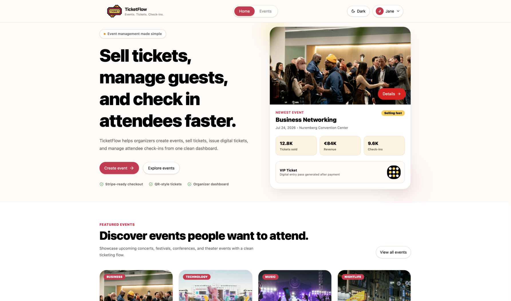

> [!NOTE]
> This document covers only the React application in this directory. Backend APIs, the payment service, and PDF generation are integrations consumed by the frontend, not code contained here.

## Table of contents

- [Project highlights](#project-highlights)
- [Project at a glance](#project-at-a-glance)
- [System context](#system-context)
- [Live demo](#live-demo)
- [Overview](#overview)
- [Features](#features)
- [Tech stack](#tech-stack)
- [Project architecture](#project-architecture)
- [Folder structure](#folder-structure)
- [Reusable UI system](#reusable-ui-system)
- [State management](#state-management)
- [API integration](#api-integration)
- [Engineering decisions](#engineering-decisions)
- [Performance and frontend quality](#performance-and-frontend-quality)
- [Local development](#local-development)
- [Roadmap](#roadmap)
- [Lessons learned](#lessons-learned)
- [Portfolio highlights](#portfolio-highlights)

## Project highlights

| Experience | Implemented capability |
|---|---|
| Responsive React application | Adaptive public pages, checkout, account screens, admin tables, and a mobile-first QR scanner |
| Role-based experience | Distinct buyer, organizer, and administrator routes and actions |
| JWT authentication | Session restoration, local/session persistence, bearer injection, token refresh, and retry |
| Event discovery | API-backed search, category filters, event cards, details, and pagination |
| Organizer tools | Event creation/editing, publication previews, event management, and attendee check-in |
| Admin dashboard | User views, organizer review filters, approval, rejection, and rejection reasons |
| Ticket checkout | Inventory-aware quantities, calculated totals, order creation, and payment handoff |
| Theme system | Persistent light and dark modes based on semantic CSS tokens |
| API integration | Separated auth, event, and order modules over a shared Axios client |

## Project at a glance

Repository counts below are taken directly from `src/` and exclude generated output and dependencies.

| Metric | Count | Scope |
|---|---:|---|
| Page modules | 19 | All `.tsx` files in `src/pages`, including the route-gate screen |
| Implemented component modules | 34 | Non-empty `.tsx` files in `src/components`; three empty placeholders are excluded |
| Custom hooks | 1 | `useEventForm` |
| API-layer files | 4 | Shared Axios client plus auth, event, and order API modules |
| Supported roles | 3 | Buyer, organizer, and admin |
| Routed product areas | 8 | Public discovery, authentication, profile, checkout, orders, tickets, organizer tools, and admin tools |

## System context

The React frontend is the browser-facing part of a wider ticketing system. It calls REST and payment endpoints but does not contain the Django, PostgreSQL, Express, Stripe, or webhook implementations.

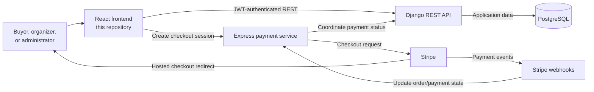

From the frontend’s perspective, Django owns application resources and authorization, while the Express service creates Stripe checkout sessions and serves ticket PDFs. The browser redirects to Stripe for payment and returns to dedicated success or failure routes.

## Live demo

**Live demo coming soon.** No deployment URL is currently configured or documented in this repository.

## Overview

TicketFlow is the client application for an event management and ticketing platform. It replaces a fragmented journey—finding an event, choosing inventory, paying, retrieving a ticket, and validating entry—with one coherent interface.

The product serves three audiences:

- **Buyers** browse published events, place orders, continue to hosted payment, manage purchases, and retrieve QR tickets.
- **Organizers** create and edit events, submit drafts for publication, monitor event states, and check attendees in from a phone or tablet.
- **Administrators** inspect user groups and approve or reject organizer applications with an auditable reason.

The frontend is designed around four objectives: make event discovery fast, make ticket selection legible, keep privileged tools role-specific, and preserve a usable workflow from wide desktop screens down to venue-floor mobile devices.

## Features

### Public experience

- API-driven home page with newest-event hero, up to four featured events, product walkthrough, platform statistics, and calls to action
- Sticky desktop header, compact mobile bottom navigation, shared footer, and persistent light/dark theme preference
- Dedicated 404 and intentionally scoped “Coming Soon” portfolio routes
- Route-level code splitting with `React.lazy` and a shared Suspense loading overlay

### Event discovery

- Published event listing ordered by start date
- Search across the backend-supported event index
- Music, business, food, technology, and sports category chips
- Six-item pagination, loading overlay, result count, and no-results state
- Reusable event cards with compact, horizontal, and hero presentations

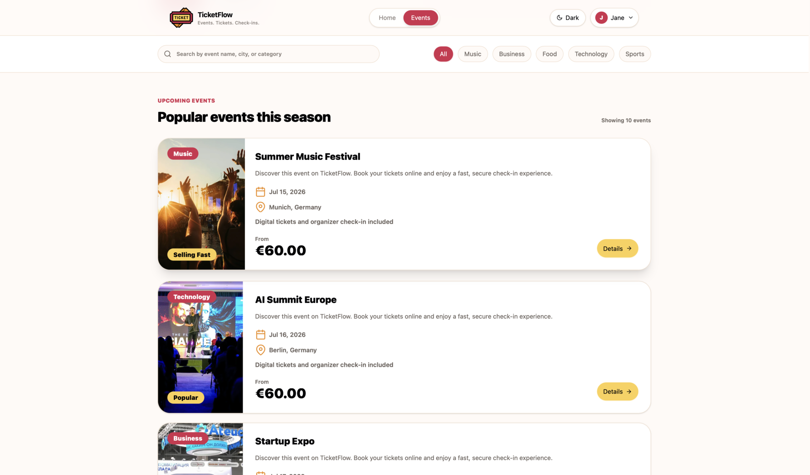

<p align="center"><sub><strong>Desktop discovery:</strong> searchable and filterable event inventory with clear metadata and pricing.</sub></p>

### Authentication and account management

- Buyer and organizer registration paths in a single adaptive form
- Organizer-only company, website, and application-detail fields
- Password confirmation, terms acceptance, visibility toggles, URL normalization, and native required-field validation
- Login with optional persistent sessions (“Remember me”)
- Profile editing, password changes, email-verification metadata, and organizer approval/rejection feedback
- Authentication and role gates for buyer, organizer, and admin routes

> [!IMPORTANT]
> Google, Apple, Facebook, “Forgot password,” and several footer destinations are currently visual affordances or portfolio-preview links; OAuth and password recovery are not implemented in this frontend.

### Event details

- Cover-led event hero with title, description, date, venue, organizer, and address
- Ticket-type cards exposing price, remaining inventory, and product benefits
- Quantity selection with inventory limits and a computed total
- Organizer preview banners for draft, pending, published, cancelled, and completed states
- Draft-to-review publication request from preview mode

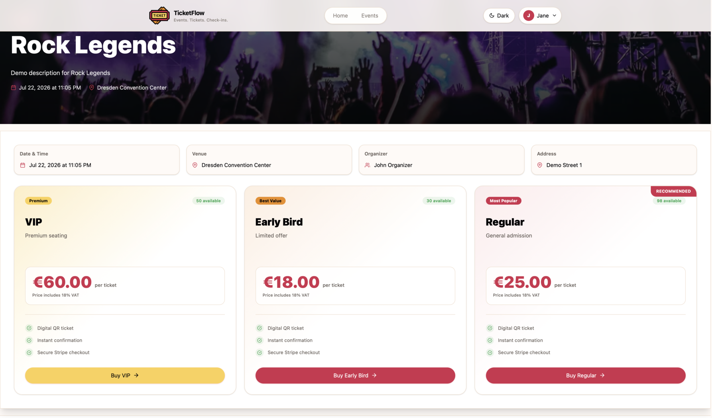

<p align="center"><sub><strong>Event detail:</strong> event context and three ticket tiers remain visible at a glance.</sub></p>

### Ticket purchase flow

- Authenticated checkout route seeded from event-detail ticket selection state
- Per-tier increment/decrement controls constrained by remaining quantity
- Live ticket count, subtotal, included 18% VAT, service-fee display, and total calculation
- Order creation followed by a payment checkout-session request and browser redirect
- Searchable, filterable, sortable order history with refresh, pagination, cancellation, payment continuation, and ticket links
- Dedicated payment-success and payment-failure recovery screens

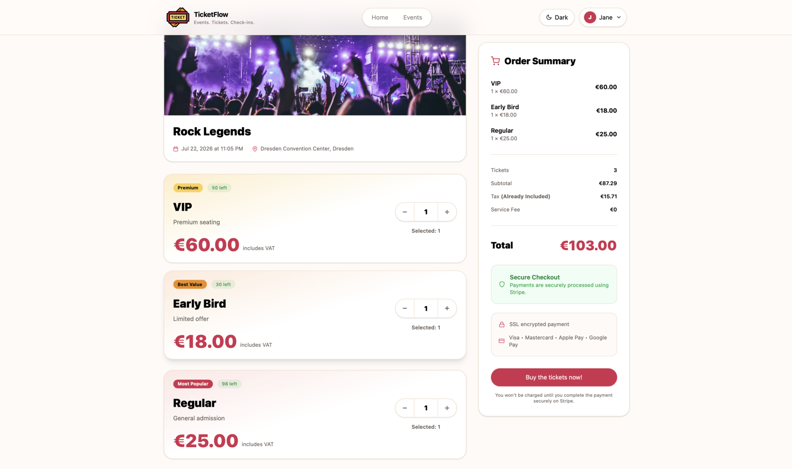

<p align="center"><sub><strong>Desktop checkout:</strong> ticket inventory sits beside a continuously updated order summary.</sub></p>

<table>
  <tr>
    <td>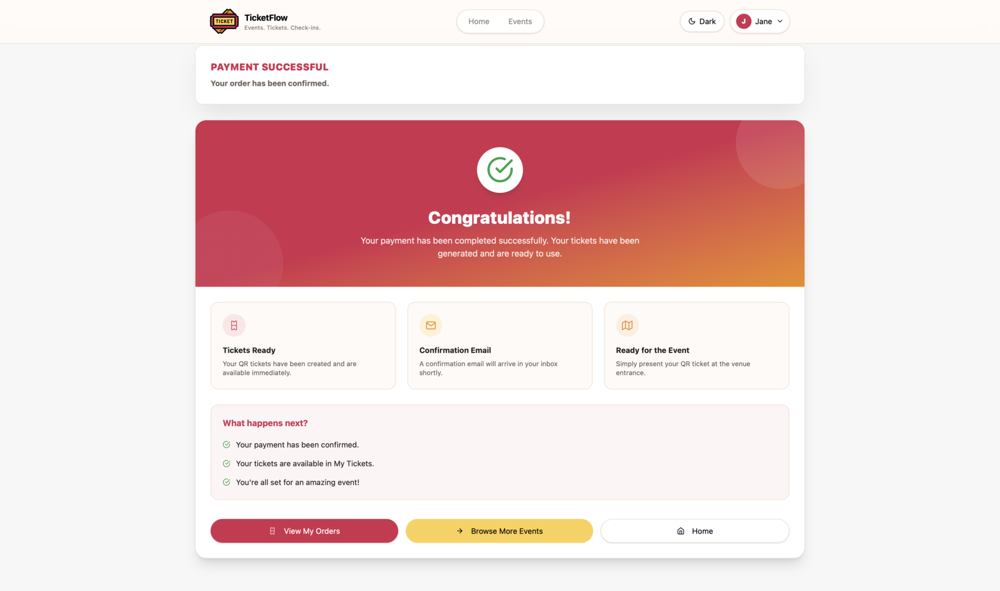</td>
    <td>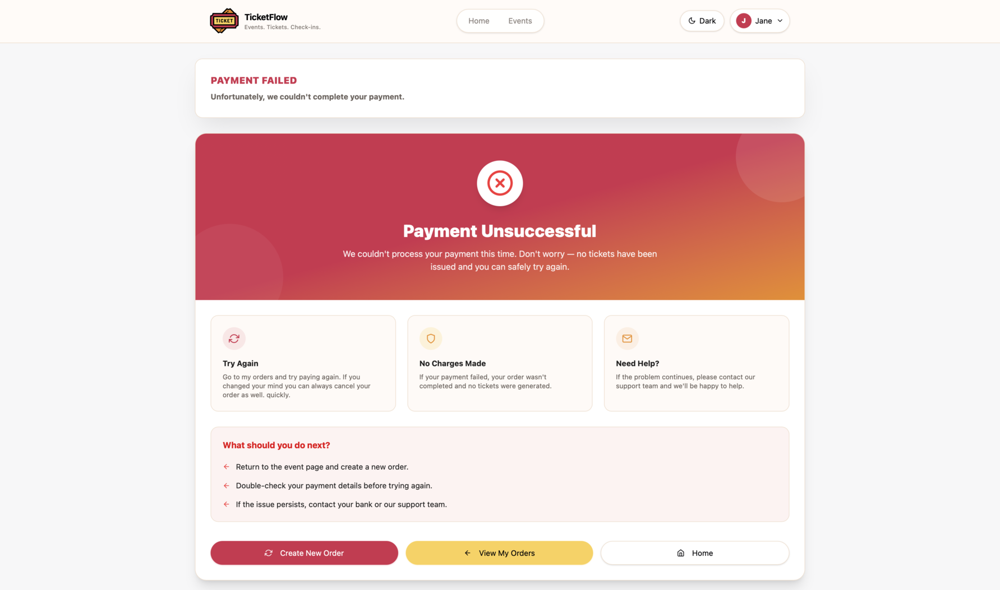</td>
  </tr>
  <tr>
    <td align="center"><sub><strong>Successful payment:</strong> sets expectations for ticket availability and the next action.</sub></td>
    <td align="center"><sub><strong>Failed payment:</strong> explains the outcome and provides safe recovery routes.</sub></td>
  </tr>
</table>

### Digital tickets

- Order-scoped and event-filtered ticket retrieval
- Search, active/used/cancelled/refunded filters, ticket-type filtering, sorting, and pagination
- In-app QR rendering with `react-qr-code`
- PDF ticket download through the ticket service

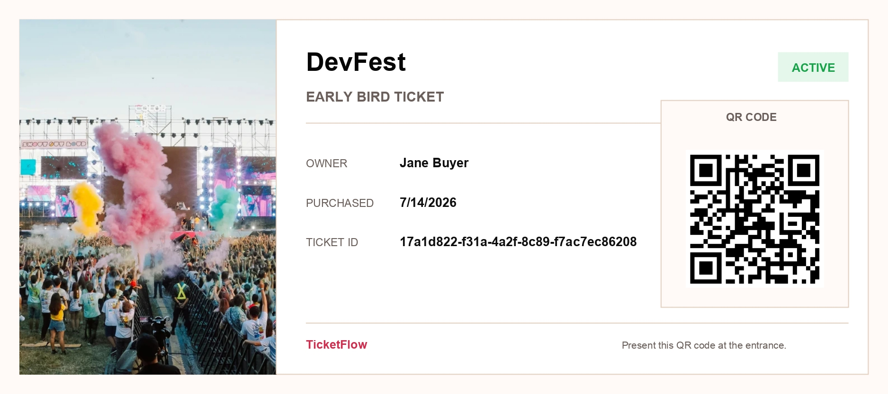

<p align="center"><sub><strong>Downloadable ticket:</strong> a venue-ready artifact with the identity and QR payload required for entry.</sub></p>

### Organizer dashboard

- Multipart event creation and editing, including cover-image preview/upload
- Structured basic information, location, date/time, and ticket-tier inputs
- Live event summary and API error feedback
- Paginated event management with search, status chips, ordering, API statistics, and contextual preview/edit actions
- Publication lifecycle messaging for draft, pending, published, cancelled, and completed events
- Camera-driven QR scanner, mobile-device guidance, scan locking, successful/failed scan states, last-ticket details, and ten-item recent history

### Admin dashboard

- Separate buyer, organizer, and administrator views
- User totals and role/approval breakdowns returned with the paginated API response
- Search and organizer approval-status filters
- Inline approve/reject decisions, mandatory rejection reasons, update progress, and error feedback
- Responsive fixed-sidebar administration shell and overflow-safe data table

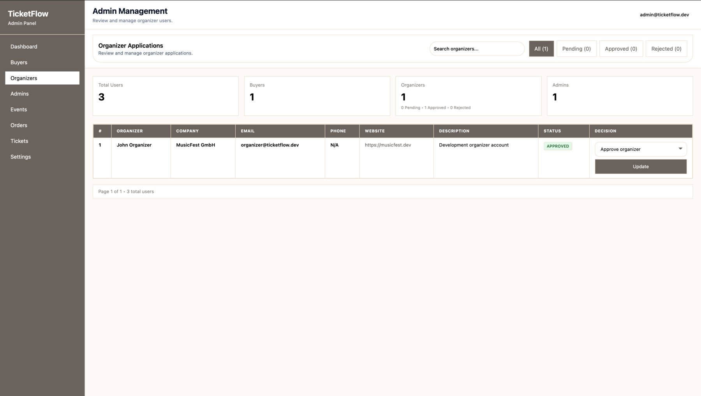

### Responsive design

The interface starts at a `320px` minimum width and uses Tailwind breakpoints to move from single-column flows to split heroes, card grids, sticky summaries, dashboard sidebars, and horizontal action rows. On small screens, horizontal overflow is clipped, scrollbars are suppressed, navigation moves to a fixed two-item bottom bar, and checkout/scanner controls become touch-friendly stacked layouts.

#### Discovery and event selection

<table>
  <tr>
    <td>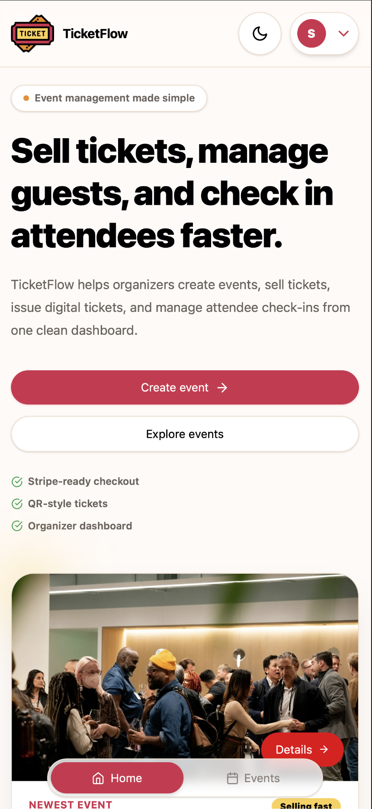</td>
    <td>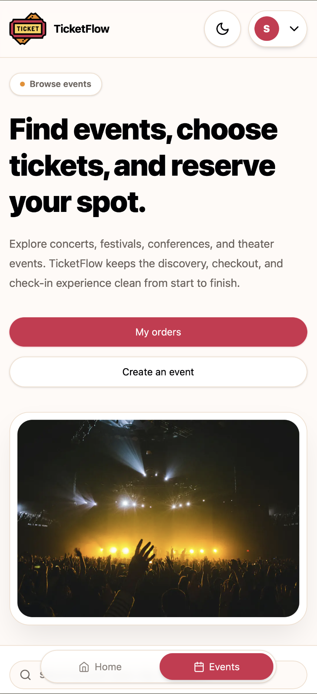</td>
    <td>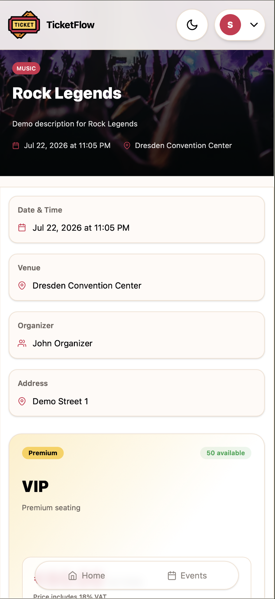</td>
  </tr>
  <tr>
    <td align="center"><sub><strong>Home:</strong> event discovery starts with a compact hero.</sub></td>
    <td align="center"><sub><strong>Events:</strong> filters and inventory become a vertical browsing flow.</sub></td>
    <td align="center"><sub><strong>Details:</strong> metadata and ticket choices remain legible on a narrow screen.</sub></td>
  </tr>
</table>

#### Checkout and payment feedback

<table>
  <tr>
    <td>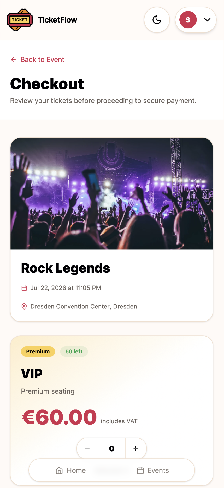</td>
    <td>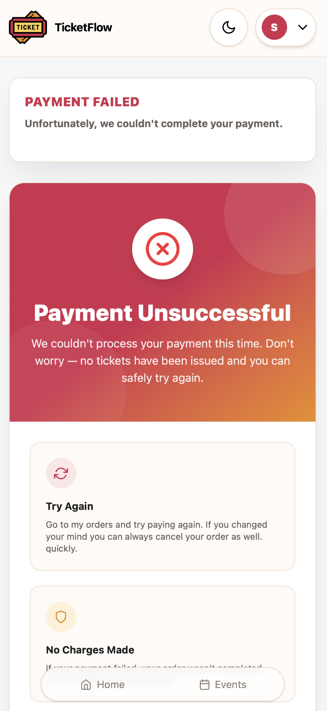</td>
    <td>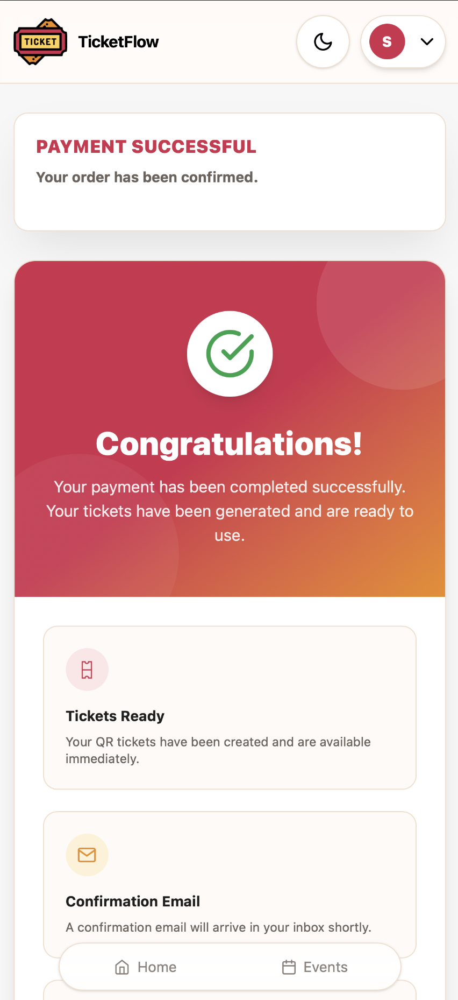</td>
  </tr>
  <tr>
    <td align="center"><sub><strong>Checkout:</strong> selection and totals are stacked in purchase order.</sub></td>
    <td align="center"><sub><strong>Confirmation:</strong> next steps remain explicit after payment.</sub></td>
    <td align="center"><sub><strong>Recovery:</strong> failure guidance and safe actions are easy to scan.</sub></td>
  </tr>
</table>

#### Venue check-in

<table>
  <tr>
    <td>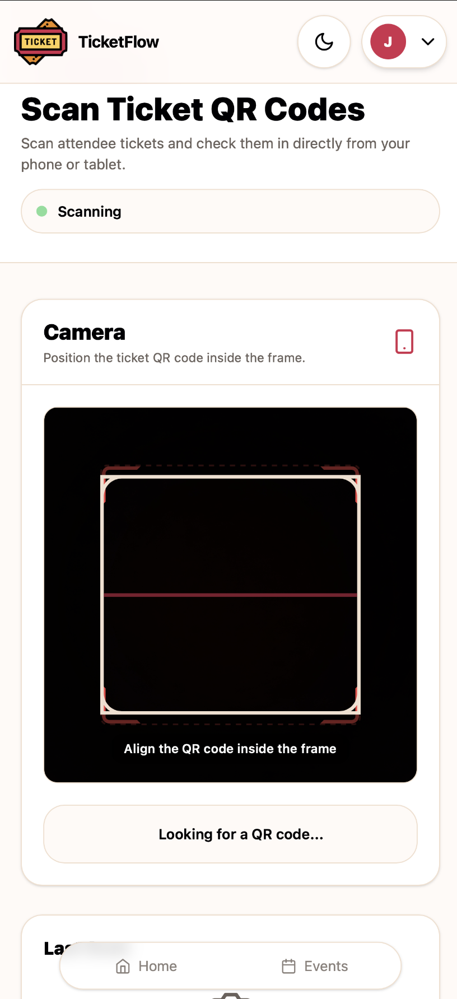</td>
    <td>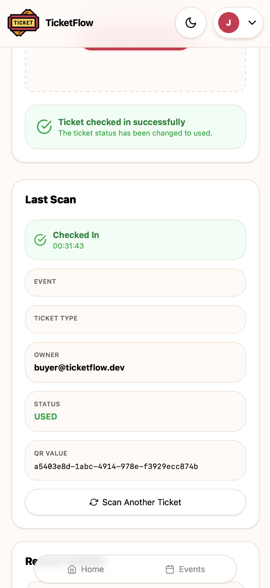</td>
  </tr>
  <tr>
    <td align="center"><sub><strong>Live scanning:</strong> a camera-first interface with an explicit framing target.</sub></td>
    <td align="center"><sub><strong>Check-in confirmation:</strong> ticket status, owner, QR value, and the next action are immediately available.</sub></td>
  </tr>
</table>

### Accessibility and user experience

- Semantic buttons, forms, labels, headings, tables, and descriptive image alternative text
- `aria-label`/`title` text for icon-only theme and pagination controls
- Visible focus treatments and disabled-state behavior in shared form controls
- Loading overlays, empty results, not-found views, inline status banners, and Sonner toast feedback
- Color tokens that support paired light and dark themes
- Hover transitions, card elevation, image scaling, and loading animations that preserve task clarity

Accessibility has been considered in component markup, but the repository does not include an automated accessibility test suite or a stated WCAG conformance claim.

## Tech stack

| Layer | Technology | How it is used |
|---|---|---|
| UI runtime | React 19, React DOM 19 | Component rendering, Context, local state, effects, memoization, refs, and lazy loading |
| Language | TypeScript 6 | Strict application and API domain models with unused-code checks |
| Build tooling | Vite 8, React plugin | Development server, production bundling, environment injection, and HMR |
| Styling | Tailwind CSS 4, `@tailwindcss/vite` | Utility-first responsive layouts plus CSS-variable semantic design tokens; no separate Tailwind config file |
| Routing | React Router DOM 7 | Browser routing, nested role gates, route parameters, navigation state, and search parameters |
| HTTP | Axios 1 | Typed API modules, bearer-token injection, refresh/retry interception, multipart requests, and blob downloads |
| Forms | Controlled React inputs + native validation | Generic typed `FormFields`, page-level validation, and `FormData` uploads; React Hook Form and Zod are not dependencies |
| Feedback | Sonner | Global rich-color success, warning, and error toasts |
| Icons | React Icons | Feather, Font Awesome, Material, and other icon sets through React components |
| QR | `react-qr-code`, `@yudiel/react-qr-scanner` | Buyer ticket rendering and organizer camera scanning |
| Quality | ESLint 10, typescript-eslint | Recommended JavaScript, TypeScript, Hooks, and Vite refresh rules |

## Project architecture

The frontend separates route composition, workflow orchestration, reusable presentation, authentication, and transport concerns. The dependency flow stays easy to trace:

- **Pages** own screen-level fetching, filters, forms, mutation state, totals, and navigation.
- **Layouts** provide the public header/footer shell, shared account framing, and the fixed-sidebar admin shell.
- **Reusable components** implement event cards, typed form fields, buttons, filters, pagination, loading states, statistics, and domain-specific event/admin UI.
- **Hooks** isolate reusable workflow logic; `useEventForm` manages event creation state and multipart submission.
- **Context providers** keep the authenticated user and token lifecycle available without passing session props through every route.
- **API layer** groups authentication, event, and order endpoints behind one configured Axios client.
- **Route protection** uses nested `RequireRole` boundaries for authenticated, organizer/admin, and admin-only screens.
- **Shared types** define API contracts for users, events, orders, tickets, profiles, and paginated responses.

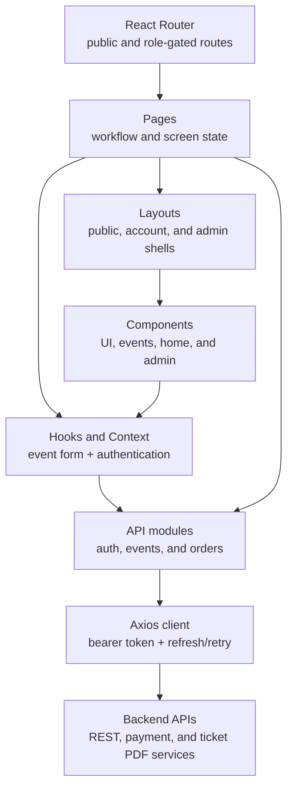

Route components are lazy-loaded except for the home page. `RequireRole` renders nested routes only after an authenticated user exists and optionally checks `buyer`, `organizer`, or `admin` membership. This keeps authorization intent visible in the route table while leaving server-side authorization as the final security boundary.

## Folder structure

```text
src/
├── api/          # Axios client and auth, event, and order endpoint functions
├── components/   # Shared UI plus domain-focused admin, event, home, and layout components
├── context/      # Authentication identity, tokens, persistence, and account actions
├── data/         # Typed event-form field definitions and static showcase data
├── hooks/        # Reusable event-creation form workflow
├── pages/        # Route-level screens and orchestration state
├── types/        # Auth, user, event, order, profile, and pagination contracts
├── utils/        # API error normalization and profile presentation helpers
├── App.tsx       # Lazy route graph and role boundaries
├── main.tsx      # BrowserRouter, AuthProvider, and global Toaster composition
└── index.css     # Tailwind import, theme tokens, base behavior, and mobile safeguards
```

`public/` contains runtime-served logos and event artwork. `screenshots/` contains the desktop, mobile, scanner, and generated-ticket captures embedded throughout this README. There are no separate `layouts/`, `services/`, or `routes/` directories: those responsibilities live in `components/layout`, `api`, and `App.tsx`, respectively.

## Reusable UI system

| Building block | Responsibility |
|---|---|
| `Button` / `ThemeToggle` | Four visual variants, three sizes, full-width/disabled states, and persisted theme switching |
| `FormFields` | Typed text, email, password, telephone, URL, number, datetime, checkbox, textarea, and select rendering |
| `EventCard` | Compact home, horizontal discovery, and feature-hero event presentations |
| `EventForm` / `EventSummary` | Shared create/edit sections, image preview, ticket inputs, live summary, and submission state |
| `Header` / `Footer` / `PageContainer` | Public navigation, responsive mobile navigation, shared account-page framing, and footer content |
| `PageDashboard`, `PageHeader`, `StatsGrid` | Consistent account and management-page hierarchy |
| `SearchInput`, `FilterChips`, `AppSelect`, `Pagination` | Repeatable query and collection controls |
| `Loading`, `SettingsCard`, `CardHeader` | Async feedback and consistent settings surfaces |
| Admin components | Sidebar/top bar shell, toolbar, status badge, loading/empty states, and overflow table container |

Three placeholder component files—`Badge.tsx`, `Card.tsx`, and `Logo.tsx`—are currently empty and are not presented as implemented UI primitives.

## State management

- **React Context:** `AuthContext` exposes the current user, access/refresh tokens, authentication status, organizer pending status, login, registration, logout, and user updates.
- **Local component state:** pages own form values, query controls, loading/error flags, quantities, scanner state, and API results.
- **Custom hooks:** `useEventForm` encapsulates event draft state, ticket mutations, multipart creation, feedback, and navigation.
- **URL state:** route slugs/IDs select event, checkout, preview, and ticket resources; `MyTickets` also reads an optional `event` search parameter.
- **Navigation state:** event-detail ticket quantities are forwarded into checkout through React Router location state.
- **Server state:** data is fetched with effects and refreshed explicitly after mutations. There is no external cache/server-state library.

## API integration

`src/api/client.ts` creates a JSON Axios instance from `VITE_API_BASE_URL`, falling back to `http://127.0.0.1:8000/api`, with a ten-second timeout.

1. A request interceptor reads the active access token from local or session storage and adds `Authorization: Bearer …`.
2. A `401` from a protected endpoint triggers one refresh request.
3. Rotated access/refresh tokens are saved and the original request is replayed once.
4. A second failure clears both stores and redirects to `/login`.
5. Public login, registration, and refresh endpoints are excluded from the retry loop.

“Remember me” stores the session in `localStorage`; otherwise tokens live in `sessionStorage`. On boot, the provider restores tokens and calls `/v1/users/me/` to hydrate the user. API errors are normalized from common Django REST Framework/SimpleJWT shapes and status codes into user-facing messages.

The event API covers published discovery, managed listings/details, creation, and editing. The order API covers ordering, cancellation, ticket lists, scanning, and ticket downloads. Payment checkout creation and ticket PDF download currently target `localhost:5001` directly, so those service URLs should be moved into environment configuration before deployment.

## Engineering decisions

| Decision | Evidence in the codebase | Benefit |
|---|---|---|
| Use Context for authentication | `AuthProvider` wraps the router tree and exposes identity, tokens, login, registration, logout, and `setUser` | Session state is cross-cutting but small enough that an additional state library is unnecessary |
| Use Axios as the transport boundary | One client configures the base URL, timeout, bearer header, refresh request, retry, and session expiry redirect | Authentication and error-prone HTTP behavior are applied consistently |
| Keep API logic out of UI components | `authApi.ts`, `eventApi.ts`, and `orderApi.ts` expose domain functions consumed by pages and hooks | Components focus on interaction and rendering while endpoint details remain centralized |
| Use semantic Tailwind tokens | `index.css` maps `background`, `surface`, `border`, `primary`, `muted`, and status colors for both themes | Components express visual intent and switch themes without duplicating palettes |
| Protect routes by role | `RequireRole` wraps authenticated, organizer/admin, and admin-only route groups in `App.tsx` | Navigation policy is declarative and unauthorized users receive a dedicated gate screen |
| Separate public slugs from internal identifiers | Public details and checkout use `/events/:slug`; managed previews, orders, tickets, and users use ID fields from typed API models | Shareable event URLs remain readable while mutations and owned resources use stable backend identities |
| Keep server state local for now | Pages fetch with effects and refresh explicitly after mutations | The current data volume stays understandable without introducing cache invalidation complexity prematurely |

## Performance and frontend quality

- **Route-level code splitting:** 17 route pages are loaded with `React.lazy`; the home page remains in the entry bundle.
- **Suspense fallback:** the route tree uses one shared loading overlay while lazy chunks resolve.
- **Memoized derivations:** `useMemo` is used for authentication context values, pagination totals, filtered event lists, ticket types, and checkout totals.
- **Bounded collections:** public events use six-item pages; events, orders, tickets, and admin users use ten-item pages.
- **Debounced queries:** order and ticket searches wait 500 ms before issuing a filtered request. Event and admin search inputs currently request immediately.
- **Server-side query parameters:** search, ordering, category, status, date, price, and pagination values are sent through the API modules rather than loading entire datasets.
- **Reusable rendering primitives:** shared cards, forms, filters, selects, pagination, and loading states reduce duplicated UI behavior.
- **TypeScript checks:** the production script runs `tsc -b` before Vite bundles the application; shared models cover API request and response shapes.
- **Production bundling:** Vite builds minified, hashed assets, while ESLint applies TypeScript, Hooks, and React Refresh rules.

Images are responsive through CSS sizing and object-fit behavior. The main event-detail cover is explicitly loaded eagerly; general image lazy loading is not currently implemented and remains a roadmap opportunity.

## Local development

### Prerequisites

- Node.js 22 or newer (matching the included Docker image)
- npm
- Reachable TicketFlow API and, for payment/PDF flows, the companion service currently expected on port `5001`

### Install and run

```bash
git clone <repository-url>
cd <repository-directory>/web
npm install
cp .env.example .env
npm run dev
```

Set the API origin in `.env`:

```dotenv
VITE_API_BASE_URL=http://127.0.0.1:8000/api
```

Vite prints the local URL when the development server starts (normally `http://localhost:5173`).

### Quality and production commands

```bash
# Type-check and create the production bundle
npm run build

# Run the configured lint rules
npm run lint

# Serve the production bundle locally
npm run preview
```

An optional development container is included:

```bash
docker build -t ticketflow-web .
docker run --rm -p 5173:5173 --env-file .env ticketflow-web
```

## Roadmap

The items below are planned improvements, not completed features:

- Implement Google, Apple, and Facebook OAuth behind the existing provider controls.
- Complete email-verification actions and password-recovery flows instead of informational or placeholder UI.
- Add unit and integration coverage with Vitest and React Testing Library, plus Playwright journeys from discovery through check-in.
- Run formal keyboard, screen-reader, contrast, and automated accessibility audits; document the resulting conformance target.
- Add real-user performance monitoring, error reporting, and privacy-aware product analytics.
- Replace blocking loading overlays with layout-matched skeletons and add lazy loading for below-the-fold imagery.
- Add internationalization for interface copy, dates, currencies, and locale-aware checkout presentation.
- Move payment/PDF service origins and commercial values such as VAT and currency into typed runtime configuration.
- Add request cancellation and consider a server-state cache as concurrent workflows and data volume grow.
- Remove placeholder navigation actions and empty component files, or implement the intended destinations and primitives.

## Lessons learned

TicketFlow’s strongest frontend decision is to model workflows around domains rather than around isolated screens. Event contracts and ticket contracts are shared from API boundary to component props; the create/edit experience reuses the same typed form and summary; collection controls recur across events, orders, tickets, and admin users. That reduces drift while leaving pages free to own orchestration.

Responsiveness is treated as workflow design, not just smaller CSS. The desktop checkout keeps its summary sticky, while mobile preserves the same calculation in reading order. The scanner is intentionally camera-first and reports a completed mutation before inviting the next scan. Role gates centralize navigation policy, and the Axios layer centralizes session recovery, preventing those concerns from leaking through every page.

The architecture also exposes sensible next scaling steps. Today, Context and local state are proportionate to the application; as server interactions grow, a query cache and tested reducer/state-machine boundaries would improve concurrency and scanner reliability. The semantic token layer already provides a stable base for expanding the visual system without rewriting product pages.

## Portfolio highlights

This frontend demonstrates:

- Modern React architecture with lazy routes, hooks, Context, and typed component contracts
- End-to-end TypeScript modeling across authentication, users, events, orders, and tickets
- Reusable, responsive UI built on Tailwind CSS v4 and semantic theme tokens
- Buyer, organizer, and administrator experiences in one coherent route architecture
- JWT authentication, persistence choices, automatic token rotation, and protected routes
- REST integration, multipart uploads, blob downloads, payment redirect handoff, and QR workflows
- Thoughtful loading, empty, failure, recovery, and status-driven interface states
- Maintainable component boundaries with clear opportunities for testing and production hardening

---

<div align="center">
  <strong>TicketFlow turns a multi-role event lifecycle into a focused, responsive frontend—from discovery to the door.</strong>
</div>
